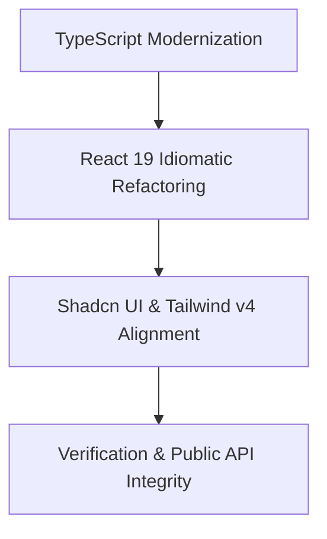

# EzUX Dependency and Framework Modernization Plan

This document records the modernization work for EzUX 1.1.20, aligned with **TypeScript 7**, the TypeScript 6 declaration-consumer bridge, **React 19**, and modern **Shadcn UI** & **Tailwind CSS v4** patterns.

---

## 📋 Modernization Roadmap Overview



---

## 1. TypeScript Modernization
EzUX source is compiled with **TypeScript 7**. Tooling that still requires the compiler API uses the official TypeScript 6 compatibility package, while generated declarations are checked with TypeScript 6.0.3 for consumer compatibility.

### 🛠️ [TS-1] Deprecation Cleanup & Configuration Update
* **Completed**: The configuration in [tsconfig.json](file:///Users/zed/Documents/ezux/tsconfig.json) uses strict TypeScript 7-compatible settings, ES2022 output, bundler module resolution, explicit global types, and an explicit source root.
* **Implementation**:
  - Remove `"ignoreDeprecations": "6.0"`.
  - Remove `"baseUrl": "."` and update module import paths to use clean relative paths or standard subpath/tsconfig alias mappings.
  - Update `"target"` to `"ES2022"` or `"ES2025"` to take advantage of modern JS features natively (e.g., native optional chaining, logical assignment, Temporal API type definitions).
  - Verify declarations with the clean TypeScript 6 public API check in `npm run test:public-api`.
* **Estimated Effort**: Small

---

## 2. React 19 Idiomatic Refactoring
Migrate components to use first-class React 19 features, removing deprecated helper wrappers to improve bundle size, rendering performance, and readability.

### ⚛️ [RE-1] React 19 Compatibility
* **Status**: Public components remain compatible with React 19 while preserving existing ref and package API contracts.
* **Solution**:
  - Refactor components to accept `ref` directly as a regular prop:
    ```tsx
    // Before:
    export const Button = React.forwardRef<HTMLButtonElement, ButtonProps>(({ ...props }, ref) => { ... });

    // After (React 19 style):
    export function Button({ ref, ...props }: ButtonProps) { ... }
    ```
  - Use React 19 transitions, actions, and optimistic state where they improve interaction responsiveness without changing public contracts.
* **Estimated Effort**: Medium

### ⚛️ [RE-2] Implement React 19 Hooks (`use`, `useOptimistic`)
* **Problem**: Asynchronous operations, loading state management, and optimistic updates (e.g., in Kanban board column movements or Scheduler event modifications) rely on manual promise-tracking and state triggers.
* **Solution**:
  - Integrate React 19's native `use()` hook for reading async context/promises inline where cleaner than traditional `useEffect` tracking.
  - Apply `useOptimistic()` in [useKanbanState.ts](file:///Users/zed/Documents/ezux/src/components/EzKanban/hooks/useKanbanState.ts) and [useSchedulerState.ts](file:///Users/zed/Documents/ezux/src/components/EzScheduler/hooks/useSchedulerState.ts) to handle instant drag-and-drop state updates prior to backend service confirmations.
* **Estimated Effort**: Medium

---

## 3. Shadcn UI & Tailwind CSS v4 Alignment
Optimize the components styling and configurations to align with the newest standard patterns of Shadcn UI under Tailwind CSS v4.

### 🎨 [SD-1] Tailwind CSS v4 Directives & Theme Refinement
* **Problem**: The project uses Tailwind CSS v4 (`^4.3.1`), but theme variables are still mapped using older mixin/CSS patterns.
* **Solution**:
  - Fully adapt the styling structure in [theme-vars.css](file:///Users/zed/Documents/ezux/src/theme-vars.css) and [style.css](file:///Users/zed/Documents/ezux/src/style.css) to use the native `@theme` directive features of Tailwind v4.
  - Simplify tailwind variable mappings utilizing CSS-variable-based theme properties natively instead of requiring manual PostCSS translations.
* **Estimated Effort**: Small

### 🎨 [SD-2] Modernize Shadcn UI Components Structure
* **Problem**: Component signatures in `src/components/ui` resemble older Shadcn v0.x structures.
* **Solution**:
  - Update Radix primitives and styling templates to align with the latest Shadcn UI guidelines (using simpler layouts, removing class-variance-authority boilerplate where native Tailwind utilities suffice).
  - Review options for implementing dense UI profiles (e.g., inspired by Shadcn's Rhea compact style) for data-heavy dashboard views.
* **Estimated Effort**: Medium

---

## 4. TanStack Ecosystem Updates
Maintain synchronization and utilize modern capabilities of the state and table handling libraries.

### 📊 [TSK-1] Validate TanStack Table & Form Interoperability
* **Problem**: The project runs `@tanstack/react-table` at `8.21.3` and `@tanstack/react-form` at `1.33.0`.
* **Solution**:
  - Audit all `@tanstack` imports and configurations to ensure they don't produce deprecation warnings in React 19.
  - Ensure table virtualization ([useVirtualization.ts](file:///Users/zed/Documents/ezux/src/shared/hooks/useVirtualization.ts)) uses React 19 compiler-safe dependencies to avoid infinite loops during row measurements.
* **Estimated Effort**: Small

---

## 5. Verification & Testing Strategy

To ensure zero regressions:
1. **Lint & Build**: Run `npm run build` to verify that TS target ES2022/ES2025 compiles cleanly without dependency type-checking issues.
2. **Unit Tests**: Run `npm test` to verify component state, event handlers, and custom hooks operate identically after forwardRef refactorings.
3. **Public API Integrity**: Run `npm run test:public-api` to ensure that removing `forwardRef` does not alter type exports or breaks API contracts.
4. **Visual & E2E Verification**: Run `npm run test:e2e` to verify that layout, sizing, and styling are not affected.
